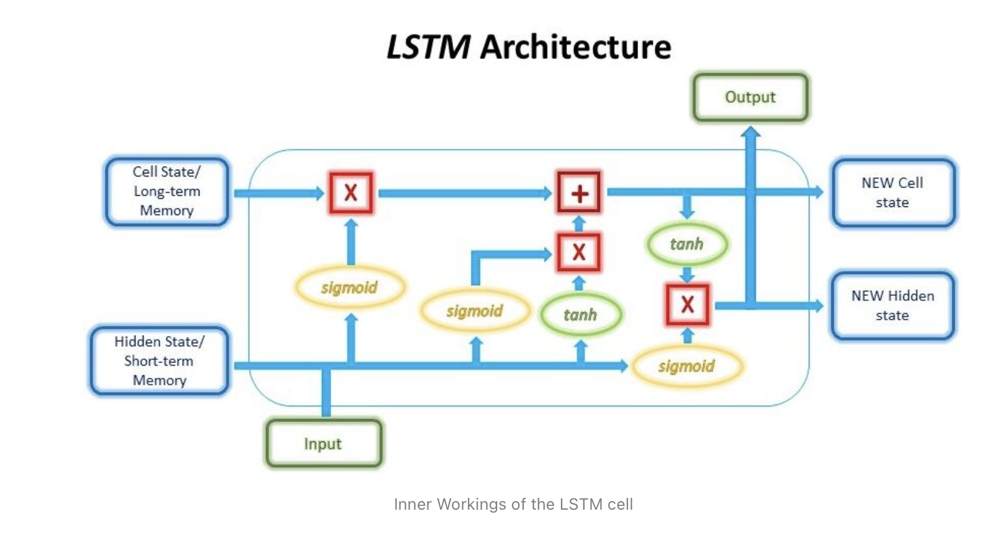

# Modeling Stock Prices and Portfolios Prediction - Capstone Project
--------------------------------------------------------------------
## Business Problem
**We would like to invest some money into stock market and have a portfolio that will maximize returns with as little risk as possible. We therefore want to minimize the risk involved while maximizing the profit.**
## Dataset Information
---------------------------------
The data was obtained from Yahoo Stock Finance using the python inbuilt library *yfinance*. We looked at the top 29 companies by weight in the S&P index (https://www.slickcharts.com/sp500), and this study includes modeling those 29 stocks and predicts portfolios with them. The symbols and abbreviations can be found at the above link (https://www.slickcharts.com/sp500).
  * The chosen order of symbols in the list is based on their weights in S&P index as described in the same link.
  * We chose a period of 10 years to look at the historical data. Also this period is used so that all the listed companies have data for the selected period.
## Analysis Approach
---------------------------------
* This is a multi-step problem that can be divided as follows:
    * First step us to build models that can predict the stock prices. The idea is that even though the model can not get the stock prices right, it should be able to predict the general trend of ups and downs in the stocks movement. Ideally we should use a few models to find the once that describes the trend best. But for now We are going to use only the below listed models:
        * Stacked LSTM model
        * ARIMA/GARCH models: done here only as exploratory analysis and will be included later as  keep improving the code quality.
    * Once we have a reliable model, we will generate predictions and then calculate returns on stocks and eventually build profitable portifolios.
    * We will use **Shapre Ratio** and also check **Volatility** as the measures to predict portfolios.
*  One needs to include sentinet analysis as well to understand the effect of news and other factors on stocks price movement. However, at this point, we have not included it due to lack of time. .
*  Other thing to include is the information contained in the SEC filings of the companies and incorporate that into models.
## Data Preparation
---------------------------------
* The data contains "Open", "Close, "Low", "High", "Adjusted Close" and "Volume" entries for each stock. Those values refer to the :
    * Open: stock opening price at the begining of the given day
    * Close: stock closing price at the end of the given day
    * Low: stock lowest price reached on the given day
    * High :Stock highest price reached on the given day
    * Adjusted Close: stock closing price on the given day after adjusting for various factors such as dividends distribution, applicable splits etc etc
    * Volume: Number of shares traded 
* Checked for stationarity in the time series by looking at auto-correlations, qq-plots, and adfuller test with and without transformation techniques (this is important to know if one builds ARIMA/GARCH models)
* Added several **Financial Indicators** to the data by using the python Librray **Finta**. Details can be found at: (https://pypi.org/project/finta/)
* The data was split into train, test and validation datasets. Since this is a time-series data, we can not shuffle data randomly. We used Keras TimeSeries Generator to build the data samples that preserve the time-order inforamtion
## Stocks Prediction using LSTM Model
---------------------------
(https://github.com/MohammadFneish7/Keras_LSTM_Diagram)
* We will use the **Long Short-Term Memory (LSTM) model**, a common deep learning recurrent neural network (RNN) used in predicting time series data. The diagram credit goes to (https://blog.floydhub.com/long-short-term-memory-from-zero-to-hero-with-pytorch/)

* LSTM has logic gates (input, output and forget gates) which give inherent ability for it to retain information that is more relevant and forgo unnecessary information. This makes LSTM a good model for interpreting patterns over long periods.
* The important thing to note about LSTM is the input, which needs to be in the form of a 3D vector (samples, time-steps, features). Hence, the input has to be reshaped to fit this.
