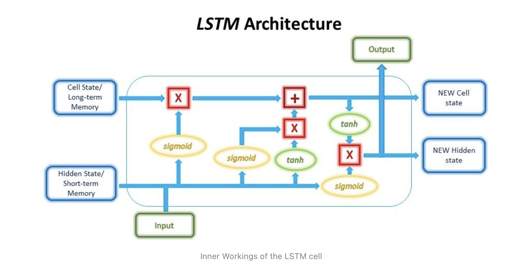

# Modeling Stock Prices and Portfolios Prediction - Capstone Project
--------------------------------------------------------------------
## Business Problem
**I would like to invest some money into stock market and have a portfolio that will maximize returns with as little risk as possible. I therefore want to minimize the risk involved while maximizing the profit.**
## Dataset Information
---------------------------------
The data was obtained from Yahoo Stock Finance using the python inbuilt library *yfinance*. We looked at the top 29 companies by weight in the S&P index (https://www.slickcharts.com/sp500), and this study includes modeling those 29 stocks and predicts portfolios with them. The symbols and abbreviations can be found at the same above mentioned link.
  * The chosen order of symbols in the list is based on their weights in S&P index as described in the same link.
  * We chose a period of 10 years to look at the historical data. Also this period is used so that all the listed companies have data for the selected period.
## Analysis Approach
---------------------------------
* This is a multi-step problem that can be divided as follows:
    * First step us to build models that can predict the stock prices. The idea is that even though the model can not get the stock prices right, it should be able to predict the general trend of ups and downs in the stocks movement. Ideally we should use a few models to find the once that describes the trend best. But for now We are going to use only the below listed models:
        * Stacked LSTM model
        * ARIMA/GARCH models: done here only as exploratory analysis and will be included later as  keep improving the code quality.
    * Once we have a reliable model, we will generate predictions and then calculate returns on stocks and eventually build profitable portifolios.
    * We will use **Shapre Ratio** and also check **Volatility** as the measures to predict portfolios.
## Data Preparation
---------------------------------
* The data contains "Open", "Close, "Low", "High", "Adjusted Close" and "Volume" entries for each stock. Those values refer to the :
    * Open: stock opening price at the begining of the given day
    * Close: stock closing price at the end of the given day
    * Low: stock lowest price reached on the given day
    * High :Stock highest price reached on the given day
    * Adjusted Close: stock closing price on the given day after adjusting for various factors such as dividends distribution, applicable splits etc etc
    * Volume: Number of shares traded 
* Checked for stationarity in the time series by looking at auto-correlations, qq-plots, and adfuller test with and without transformation techniques (this is important to know if one builds ARIMA/GARCH models).
* Added several **Financial Indicators** to the data by using the python Librray **Finta**. Details can be found at: (https://pypi.org/project/finta/).
* The data was split into train, test and validation datasets. Since this is a time-series data, we can not shuffle data randomly. We used **Keras TimeSeries Generator** to build the data samples that preserve the time-order information.
* Used TensorFlow **TensorBoard** utility to save models, plots and logs etc.
## Stocks Prediction using LSTM Model
---------------------------
(https://github.com/MohammadFneish7/Keras_LSTM_Diagram)
* We will use the **Long Short-Term Memory (LSTM) model**, a common deep learning recurrent neural network (RNN) used in predicting time series data. The diagram credit goes to (https://blog.floydhub.com/long-short-term-memory-from-zero-to-hero-with-pytorch/)

* LSTM has logic gates (input, output and forget gates) which give inherent ability for it to retain information that is more relevant and forgo unnecessary information. This makes LSTM a good model for interpreting patterns over long periods.
* The important thing to note about LSTM is the input, which needs to be in the form of a 3D vector (samples, time-steps, features). Hence, the input has to be reshaped to fit this.

### An Example of Model fitted to GOOGLE stocks Data and Prediction

  
   

* Model fits to rest of the stocks can be found under plots sub-directory.

### Pairable Stocks 
Only those stocks are paired to each other that have correlation below 0.5 and a covariance smaller than their individual values.
If a pair of stock meets both the Covariance and correlation thresholds then get paired together. The plot below shows pairable stocks in blue and unpairable ones in red.

## Risk-Adjusted Returns: (Sharpe Ratio and Volatility)
------------------------------
The **Sharpe ratio**—also known as the modified Sharpe ratio or the Sharpe index—is a way to measure the performance of an investment by taking risk into account. 
The Sharpe Ratio is calculated by determining an asset or a portfolio’s “excess return” for a given period of time. This amount is divided by the portfolio’s standard deviation, which is a measure of its volatility. To calculate the Sharpe Ratio, we use the below listed formula:
  * Sharpe Ratio = (Rp – Rf) / Standard deviation where:
    * **Rp**: return of portfolio/mean return,
    * **Rf**: risk-free rate of 3.7% ie current risk free rate of US market,
    * **Standard Deviation**: standard deviation of the portfolio’s excess return,

Sharpe ratio **> 1** is considered **Good**,**> 2** is considered **Very Good**, and **> 3** is considered **Excellent**

## Top 3 Portfolios:
--------------------------------------
Using Shapre Ratio and Portfolio Voltality, this analysis yields the following three best portfolios:

## Recommendations:
-----------------------------------
* I should invest in 3rd portfolio, since it is **diverse**, has **relatively smaller volatility**, and **better returns** as compared to the other two portfolios.

## Conclusions
---------------------------
* We have built a basic framework that:
    * fits LSTM models on all the stocks that are included in study.
    * builds Returns for each individual stocks.
    * predicts combinations of stocks to build profitable portfolios based on Shapre Ratio and Voltality.
    * Investing in top portfolio will result a return of 11%, but with somewhat higher volatility (risk).
## Future Improvements
---------------------------
* Check other models such as GARCH, Random Forests etc to get prediction for stocks movement.
* Hyperparameter tuning of Models.
* Explore the models by including few variables versus all the variables that are included in this study.
* Include the sentienet analysis which includes web-scrapping for news that affect stocks market.
* Also implement the information from SEC reports submitted by companies.

## Repository Structure
 ------
    ├── figures                             Images folder, containing all referenced image files
    ├── plots                               Images folder, that contains model fits for all the stocks
    ├── models                              Folder, that contains model fits parameters for all the stocks
    ├── logs                                Folder, that contains model logs
    ├── EDA                                 Folder that constains EDA notebooks
    ├── .gitignore                          List of files and folders not to be uploaded into repo
    ├── Stocks_Analysis.ipynb               Main Jupyter notebook, contains analysis
    ├── Stocks_Analysis.pdf                 PDF version of main Jupyter notebook
    ├── presentation.pdf                    PDF Version of presentationof the project                                       
    └── README.md                           The top-level README
    
## Contact Info:
-----
* Email: deeps.sharma@gmail.com
* GitHub: [@deepssharma](https://github.com/deepssharma)
* [LinkedIn](https://www.linkedin.com/in/deepali-sharma-a83a126/) 

